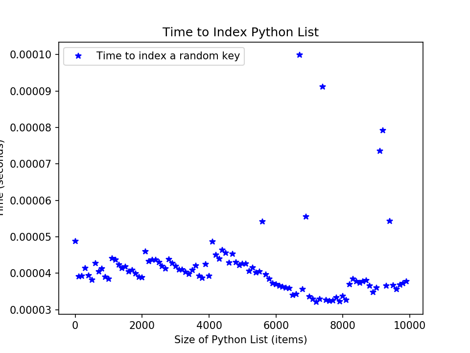
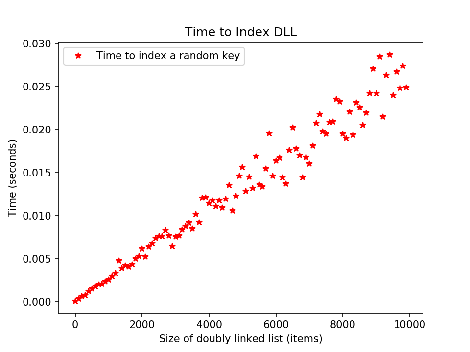
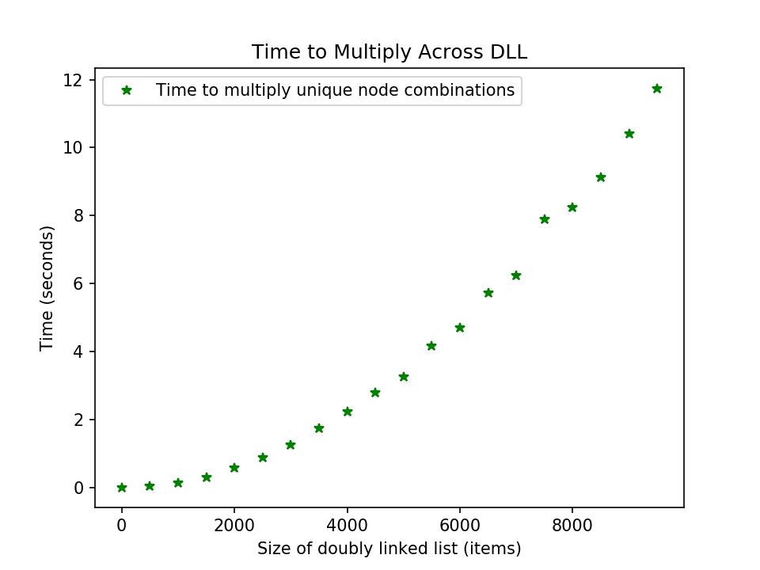

# Homework 2
*Sam Daitzman // DSA Spring 2020*

---------------------------------

1. See `./sdaitzman.py` for solutions. All functions are tested.

2. Runtime analysis
    a. Comparing the behavior of the DLL I implemented to a Python list, my DLL seems noticeably slower to index. It almost looks as though the Python list's behavior is much more proportionally variable, but may amortize to $O(1)$, whereas my DLL is clearly behaving as $O(n)$. Plots are attached.
    
    

    b. My DLL algorithm to multiply all pairs is noticeably slower. Perhaps its performance could be improved with a more intelligent algorithm, or by tracking a portion (or all) of the sum as the DLL changes. It seems to be performing at $O(n^2)$. A plot is attached.
    