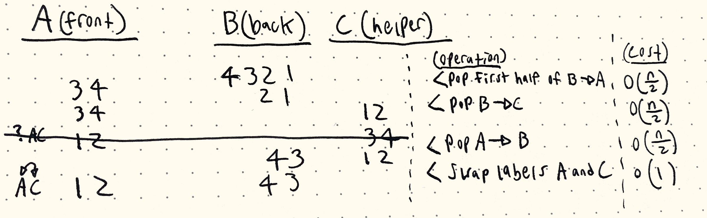

# Homework 3
*Sam Daitzman // DSA Spring 2020*

---------------------------------

# 1. Queue implemented using stacks.
> Explain how a queue can be implemented using two stacks. Then, prove that your stack-based queue has the property that any sequence of n operations (where an operation is either an enqueue or dequeue) takes a total of O(n) time resulting in amortized O(1) time for each of these operations. You may use any of the amortized analysis techniques that we discussed in class.

A queue is a data structure that supports the enqueue (add to end of list) and enqueue (take from front of list) operations. Queues are first-in first-out linear data structures.

A stack is a data structure that supports pop (remove from start of list and return) and push (add to front of list) operations. Stacks are last-in first-out linear data structures.

To implement a queue with two stacks, you can use one stack to hold the incoming "enqueued" values. To dequeue a value, you reverse the input stack by popping each value and placing them into the other stack. The first item removed from that stack will be the first one added to the first stack, because it'll be the last that was added to the second, and so on. Functionally, this reverses the stack.

## Amortized Analysis: Banker's Method
The two operations supported here are **enqueue** and **dequeue**. We know that the enqueue operation is basically free; it's $O(1)$ since enqueueing only adds it to the "in" stack. So we will assign its cost: 1 ruble. This means that $n$ enqueues will cost n rubles.

Dequeue is more complicated. Our first dequeue is much more expensive--it costs $O(n)$ time, where n is the number of items on the "in" stack that must be moved to the "out" stack. Luckily, that first operation gives us unlimited future dequeue operations of items in that stack, up to n dequeues. So, we'll say that the first dequeue costs n rubles, where n is the number of items currently in that stack. And each dequeue after that, up to n, will cost 0 rubles, because it has already been paid for.

Across both operations, any sequence of n operations will cost n rubles on average, and therefore a sequence of n operations will take $O(n)$ time. Thus, the amortized time will be $\frac{O(n)}{n}=O(1)$.

# 2. Deque Analysis: Aggregate Method
> A deque (a double-ended queue) is an abstract data type that generalizes a queue. It supports the following operations

> (a) *pop_back*: remove the element at the back of the deque.

> (b) *pop_front*: remove the element at the front of the deque.

> (c) *push_back*: add a given element to the back of the deque.

> (d) *push_front*: add a given element to the front of the deque.

Operations (c) and (d), pushing to the front or back, will be constant-time because pushing to a stack is basically always $O(1)$. This means that across n operations, this structure will take $O(1) \times n = O(n)$ time.

The pop operations are more complicated. The procedure that balances the front and back of the queue takes a series of steps. First, we pop the first half of stack B onto stack A, which is $O(\frac{n}{2})$ because it takes n/2 operations, each of which is individually $O(1)$. Second, we pop the entire B stack onto the helper C stack, which again is $O(\frac{n}{2})$. Third, we pop the entire A stack onto the B stack to reverse it, which is also $O(\frac{n}{2})$. Lastly, we swap the labels of the A and C stacks, which is $O(1)$.

Considering the aggregate of these operations intuitively, it makes sense that this would be $O(n)$ because our most expensive step in a series of operations is always a constant (1/2) times $O(n)$.

Under the aggregate method:

$$O(1) \leq O(\frac{n}{2}) \leq O(\frac{n}{2}) \leq O(\frac{n}{2})$$

# 3. Data Structure Implementation
> Construct a data structure that implements the following operations:

> (a) $enqueue$: Adds an element to the set.

> (b) $dequeue$: Removes and returns the oldest element in the set.

> (c) $find min$: Returns the minimum value in the set.

TODO: phi is just the number of items in the list and do it for the last one

# Questions to Follow Up On/Think More About
- In functions that are of big-O time $O(n*log(n))$, what base is the logarithm? Does it matter?
- How do we choose a potential function? Where can I find the table that Alice showed in class?
- How would I go about finding a useful potential function for the first exercise? What about the second one?