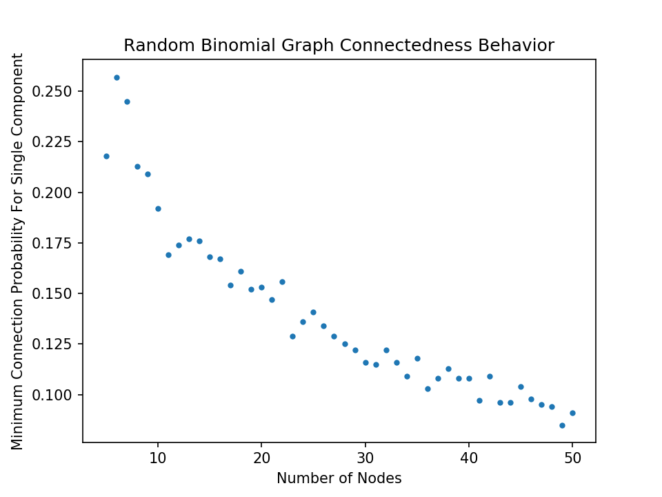

# Homework 7
*Sam Daitzman // DSA Spring 2020*

---------------------------------

## Exercise 1: Topological Sort
> A topological ordering (also called topological sort) of a directed graph G = (V, A) is an ordering of the nodes in G such that for all directed arcs (u,v), u comes before v in the ordering. An example is given below where the node label is the ordering. Explain how you could either find a valid topological ordering or determine that no such ordering exists. Include pseudocode for your algorithm and be sure to explain the logic behind your ordering.

A topological ordering exists if and only if there is not a cycle in G because if there is a cycle in G, we have a circular dependency. Within that cycle, for any two nodes $(u,v)$ with a directed arc from $u$ to $v$, $v$ cannot come either before or after $u$ in any ordering (or alternately, must come both before *and* after). Using a dependency analogy, if a cycle exists, no node in the cycle will have its dependencies satisfied to begin with, so you can't start anywhere within the cycle.

Cycles can be found through depth-first search, and detected by tracking a "visited" flag. If, for this algorithm, we encounter any node a second time in traversing from one of our start nodes, we should break from the algorithm and return an error code indicating that no topological sort exists because a cycle exists.

We iterate in two layers. First, at the outer layer, we iterate through all nodes that have no dependencies (all nodes that do not have a directed node pointing at them). At each of these points, we essentially perform a depth-first search. We build a $neighbors$ stack of the first node's neighbors (where "neighbors" means nodes separated by one edge in a traversable direction), and enter our second iterator.

In this second-layer iterator, we are looping through our $neighbors$ stack until it empties. At each node on the stack, we first check if it has been visited before within this iterator. If it has, this is when we break and return an error code. If it has already been visited *outside of this iterator* we can disregard the node. Otherwise, we should continue down the pathway depth-first, continuing to add unvisited traversable nodes we encounter to the $neighbors$ stack.

This algorithm should probably be implemented recursively, with the second-layer iterator passing progressively deeper adjacent nodes down as it recurses and maintaining a stack until it's time to add it to the topological ordering to return.

When it's time to move onto the next top-level dependency-less node, we repeat this process. Eventually, after our top-level iterator finishes, we can simply return the stack, which will contain a valid topological ordering.

This will create a valid topological ordering because we only ever begin at nodes with no dependencies, and iterate through all nodes without dependencies. Since we traverse in a depth-first manner, we know we'll encounter any cycles that exist and return an appropriate error code. If we don't, since we follow every directed edge we can follow and only reach nodes whose dependencies have been satisfied, we will include all nodes in a valid order.

```pseudocode

initialize stack neighbors
initialize some directed graph
set visited code on all nodes to false

function topological_recurse(node, UID, stack):
	node.visited = UID
	for neighbor in traversable_neighbors:
		if node.visited == UID: exit program and return CYCLE_ERROR
		if node.visited == false:
			topological_recurse(node, UID, stack)
		push node to stack
for node in dependency-less-nodes:
	generate a unique ID called UID
	call topological_recurse(node, UID, stack)

return stack

```

## Exercise 2: Count Components
Find my code attached in `./sdaitzman.py`.

## Exercise 3: Random Binomial Graph
Find my code attached in `./sdaitzman.py`.

The result shown in the image attached (Figure 1) makes sense. It shows a decay in the minimum average probability required to create a fully interconnected random binomial graph shrinking as the number of nodes grows. The decay looks like it could be exponential. This makes sense because, in any graph like this, the number of total intersections between any nodes is $n^2$ where $n$ is the number of nodes. The number of unique intersections drastically increases, so it makes sense that when sampling uniform random numbers to make these decisions, we're more likely to link a node into the main component when each node has more chances to be linked in. In other words, we're more likely to pick a random value lower than any bound among a greater number of samples.



